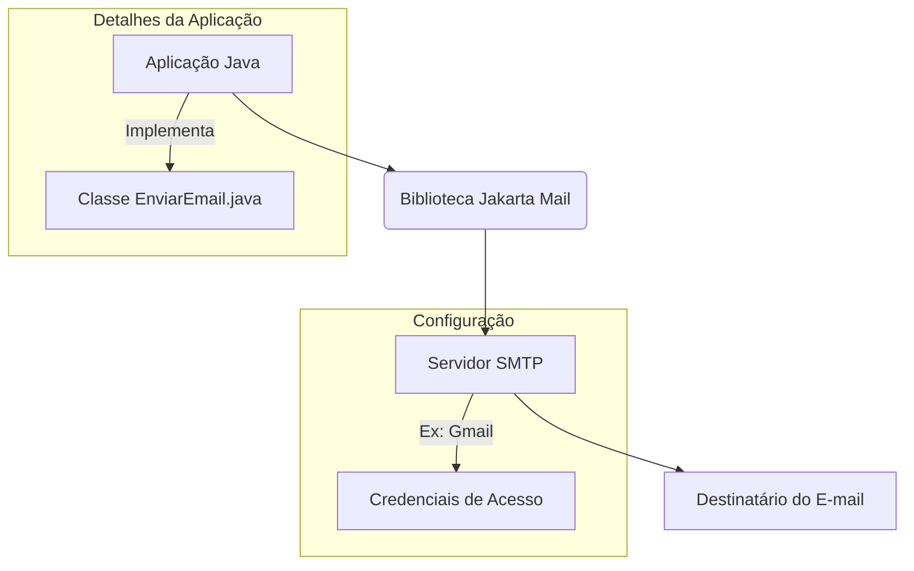
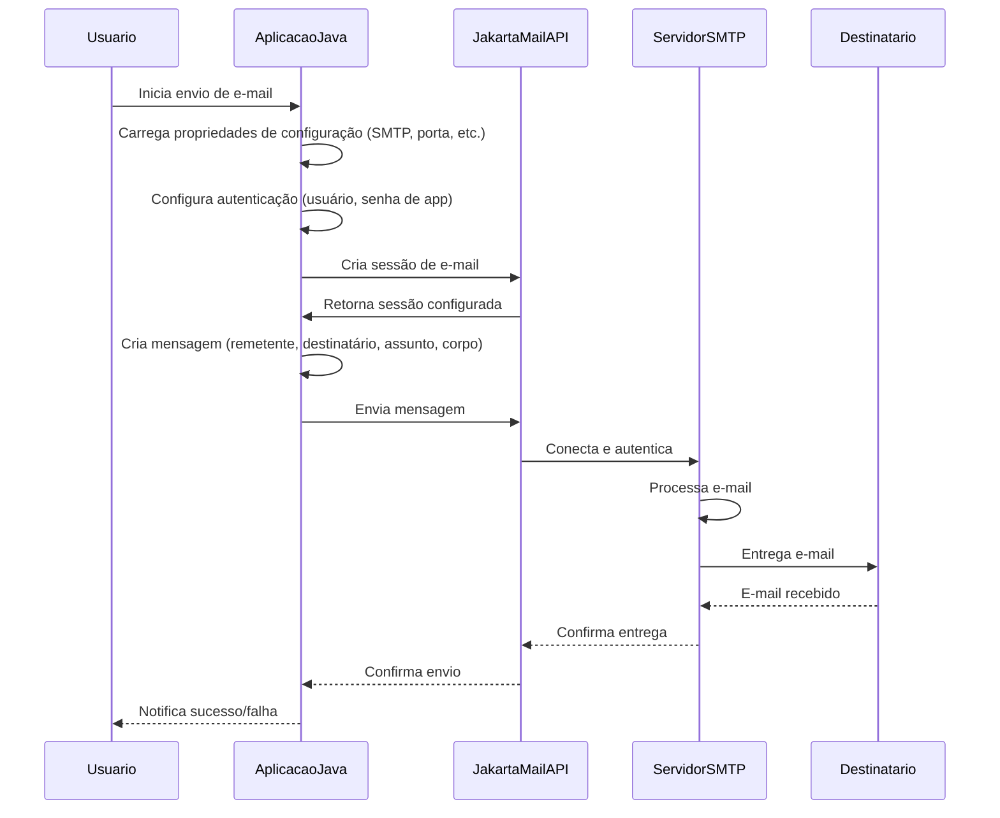

# EnviarEmail: Sistema de Envio de E-mails em Java


Este repositório apresenta o projeto **EnviarEmail**, uma solução desenvolvida em **Java** para a automação do envio de mensagens eletrônicas. A aplicação utiliza a API **Jakarta Mail** para interagir com servidores SMTP, permitindo a configuração de parâmetros de conexão e autenticação para o envio seguro de e-mails.

## Visão Geral do Projeto

O projeto EnviarEmail foi concebido para demonstrar a implementação de um cliente de e-mail programático em Java. Ele oferece uma estrutura básica para o envio de mensagens de texto simples, com foco na configuração de provedores de e-mail comuns, como o Gmail, através do protocolo SMTP. A modularidade do código facilita a integração em outras aplicações Java que necessitem de funcionalidades de comunicação por e-mail.

## Funcionalidades Implementadas

O sistema EnviarEmail provê as seguintes capacidades:

| Funcionalidade | Descrição Detalhada |
| :--- | :--- |
| **Configuração SMTP** | Permite a definição de parâmetros do servidor SMTP, como host e porta, para estabelecer a conexão com o provedor de e-mail. |
| **Autenticação Segura** | Suporta autenticação via TLS, garantindo a segurança das credenciais e da comunicação durante o processo de envio. |
| **Envio de Mensagens** | Habilita o envio de e-mails com remetente, destinatário, assunto e corpo da mensagem em formato de texto simples. |
| **Gerenciamento de Propriedades** | Utiliza o objeto `Properties` para gerenciar as configurações de conexão e autenticação de forma programática. |

## Arquitetura do Sistema

A arquitetura do projeto EnviarEmail é simplificada, focando na interação direta entre a aplicação Java e a biblioteca Jakarta Mail para o envio de e-mails. O diagrama a seguir ilustra os componentes principais e suas interações:



### Tecnologias Empregadas

O projeto foi desenvolvido utilizando as seguintes tecnologias:

*   **Java**: Linguagem de programação principal, versão 17.
*   **Apache Maven**: Ferramenta para automação de build e gerenciamento de dependências.
*   **Jakarta Mail (angus-mail)**: API para envio de e-mails, compatível com Java EE.

### Estrutura de Pacotes

A organização do código-fonte segue uma estrutura de pacotes padrão:

*   `br.com`: Contém a classe principal `EnviarEmail.java`, que encapsula a lógica de envio de e-mails.

## Fluxo de Envio de E-mails

O processo de envio de um e-mail, desde a inicialização da aplicação até a entrega ao destinatário, é detalhado no diagrama de sequência abaixo:



## Instruções de Execução

Para compilar e executar o sistema EnviarEmail, siga as diretrizes abaixo:

### Pré-requisitos

Assegure-se de que os seguintes componentes estejam instalados em seu ambiente de desenvolvimento:

*   **Java Development Kit (JDK)**: Versão 17 ou superior.
*   **Apache Maven**: Para a gestão do ciclo de vida do projeto.

### Configuração de Credenciais

Antes de executar a aplicação, é necessário configurar as credenciais de e-mail. No arquivo `EnviarEmail.java`, localize as seguintes linhas e substitua os valores pelos seus dados:

```java
final String usuario = "exemplo@gmail.com"; // Seu endereço de e-mail
final String senha = ""; // Sua Senha de Aplicativo do Google ou senha do provedor
```

**Nota:** Para contas Gmail, é recomendável utilizar uma [Senha de Aplicativo](https://support.google.com/accounts/answer/185833?hl=pt-BR) em vez da senha principal da conta, para maior segurança.

### Instalação e Compilação

1.  **Clonagem do Repositório:**
    Execute o comando a seguir em seu terminal:
    ```bash
    git clone https://github.com/GilvanPedro/EnviarEmail.git
    cd EnviarEmail/EnviandoEmail
    ```

2.  **Compilação do Projeto:**
    No diretório raiz do projeto (`EnviandoEmail`), utilize o Maven para compilar:
    ```bash
    mvn clean install
    ```

### Execução da Aplicação

Após a compilação, o arquivo JAR executável será gerado no diretório `target/`. Para iniciar a aplicação, execute:

```bash
java -jar target/EnviandoEmail-1.0-SNAPSHOT.jar
```

(O nome exato do arquivo JAR pode variar dependendo da versão configurada no `pom.xml`.)

## Contribuição

Contribuições para o aprimoramento deste projeto são bem-vindas. Sugestões, relatórios de problemas ou *pull requests* podem ser submetidos através da plataforma GitHub.

## Licença

Este projeto é licenciado sob os termos da **Licença MIT**. Detalhes adicionais sobre os direitos e permissões podem ser encontrados no arquivo [LICENSE](LICENSE) do repositório.

_Desenvolvido por Gilvan Pedro._
